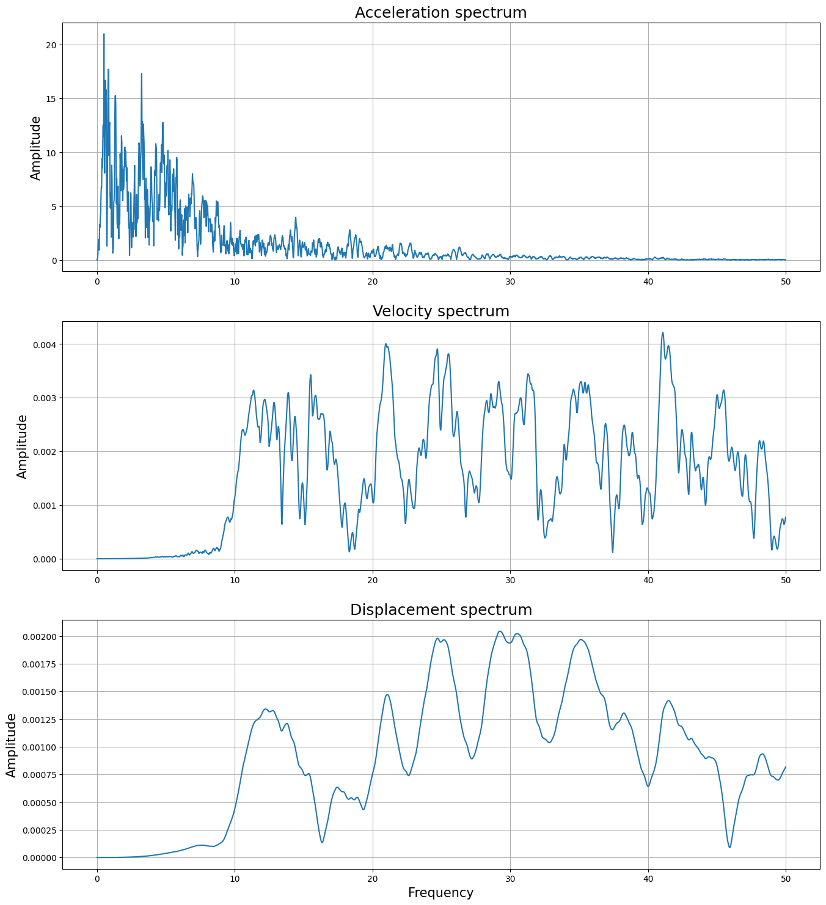

# C++ Coursework: Seismogram Processing Using the Cooley-Tukey FFT Algorithm and Numerical Integration

I have written a program, `FFT.cpp`, which reads single component seismograms from a file and uses an implementation of the Fast Fourier Transform (FFT) algorithm of Cooley and Tukey (1965) alongside numerical integration to output the spectra of acceleration, velocity, and displacement and the corresponding time domain records. I was inspired to write this program after using open source software to conduct Fourier analysis in my Horizon's class, where I computed acceleration spectra for the purpose of investigating aseismic design. I have always wondered how the Fourier Transform (FT) was computed discretely, and hearing the FFT being described as 'the most important algorithm of our lifetime' in my extra-curricular reading lead me to attempt to implement it. This was a great opportunity to become more acquainted with C type programming in a practical sense and explore an important algorithm.

## Background

Joseph Fourier put forward some important work in 1822 which proposed that any function could be expressed as a series of sinusoidal functions. For some function of time $f(t),$ the so-called Fourier transform $\mathscr{F} \{f(t)\}$ is a generalisation of the Fourier series which represents the inputted temporal data in the frequency $\omega$ domain. The transform is commonly written in this case as

$$
\mathscr{F}\{f(t)\} \Leftrightarrow F(\omega),
$$

$$
F(\omega) = \int^{\infty}_{-\infty} f(t)e^{-i2\pi\omega t} dt,
$$

where of course we have that $i=\sqrt{-1}$ and $\omega = 2\pi f$. However, notice the limits of the integral! It becomes immediately obvious from the theory that we require some discretisation if we are going to be able to compute the Fourier transform of a sample of data in the finite memory of a machine.

Well, it turns out that we can write the Discrete Fourier Transform (DFT) of $N$ data points as

$$
F_k(\omega) = \sum^{N-1}_{n=0}t_n e^{-i2\pi\frac{k}{N}n},
$$

where we find $f_k$, the frequency of the $k^{th}$ bin, by summing the product of $n$ time values $t$ and twiddle factors $\omega_n$where

$$
\omega_n \equiv e^{-i2\pi\frac{k}{N}n} = cos\left(2\pi\frac{k}{N}n\right) - isin\left(2\pi\frac{k}{N}n\right).
$$

This is sometimes referred to as the *naive* DFT because we must perform $N$ operations for both $k$ and $n$, leading to a time complexity of $O(N^2),$ which makes implementing this approach extremely innefficient for large $N$. The [Cooley-Tukey algorithm](https://en.wikipedia.org/wiki/Cooley%E2%80%93Tukey_FFT_algorithm), or *Fast* FT splits the summation into smaller subproblems by considering the odd ($2r+1$) and even ($2r$) parts separately, i.e.,

$$
F(\omega)=\sum^{\frac{N}{2}-1}_{r=0} t_{2r}e^{-i2\pi\frac{rk}{N}} + e^{-i2\pi\frac{rk}{N}}\sum^{\frac{N}{2}-1}_{r=0} t_{2r+1}e^{-i2\pi\frac{rk}{N}}.
$$

which can be written most simply as

$$
F(\omega) = Even(t) + \omega_N^t \bullet Odd(t).
$$

This approach divides the $N$ point DFT into two $N/2$ point DFTs. Thus, if $N=2^n,\ n \in \mathbb{R},$ then we can recursively or iteratively divide the DFT into smaller subproblems. This method takes advantage of the inherent symmetry in the transform in a way that allows us to have $n$ splitting stages of $N$ computations, reducing the time complexity significantly to $O(Nlog(N)). $ We hereby have an implementable algorithm to compute the Fourier transform of discrete time-domain data that is viable for large $N$.

We can also make use of the [integration property](https://www.thefouriertransform.com/transform/integration.php) of the Fourier transform, which states that

$$
\frac{d}{dt}f(t) = \frac{1}{i\omega}\mathscr{F\{f(t)\}}
$$

to compute the velocity and consequently displacement spectra of acceleration data. This so-called spectral integration avoids the iterative approach required to compute integrations in the time domain by opting for simple algebraic operations instead.

Please note: my implementation follows strongly after that of Teukolsky, Press, and Vetterling from the third edition of their book entitled 'Numerical Recipes: The Art of Scientific Computing'. I also took some inspiration from B.H Flowers' 'An Introduction to Numerical Methods in C++.

## User Guide

Upon running `FFT.cpp`, the program will list and request a file to read data from. The user should enter the file name *with* the extension, but note the input is not case sensitive. If the file reading fails the file name will be re-requested until a correct file name is supplied.

The program then requires a sampling frequency $f_s$ to be entered in $Hz$. This should be a number greater than zero. The algorithm ignores the redundancies from the middle symmetry in the data in such a way that the peak output frequency is equal to the Nyquist frequency, which is half the sampling frequency.

Finally, a tapering constant $k$ is requested from the user. This should be a number greater than zero. See Other for more information on windowing.

That is all that is required from the user! The routine will create a directory `filename_results/` upon completion and in there you will find the following files in tab delimited format:

* `acc_spectrum.txt`: the acceleration spectrum with columns of acceleration and frequency.
* `vel_spectrum.txt`: the velocity spectrum with columns of velocity and frequency.
* `disp_spectrum.txt`: the displacement spectrum with columns of displacement and frequency.
* `velocity_time.txt`: the velocity record in the time domain with columns of velocity and time.
* `displacement_time.txt`: the displacement record with columns of displacement and time.

Some example results have been computed and are stored in the folders `Loma_Prieta.dat_results/` and `sine.txt_results/`. Note that in the `Loma_Prieta.txt` results folder the file `KEEP_acc_time.txt` is the result of manipulating the script to return the inverse transform of the original acceleration record for the sake of estimating the accuracy of the IFFT routine, i.e., that which is computed when `computeFFT()` is called with `dirFlag = 1,` indicating an inverse transform.

### Example usage

Some use cases of the program have been explored in the `jupyter` notebook provided entitled 'Examples.ipynb'. Let's work through an example usage as if we wanted to process `Loma_Prieta.dat`. Note that in any case anything the user writes to the terminal is passed to the program when `<enter>` is pressed after the entry.

When  `main()` is called, the following will appear

`>> Hello!`

`>> Here are the files in \data:`

`"Kocaeli.dat"`
`"Loma_Prieta.dat"`
`"Northridge.dat"`
`"sine.txt"`

`>> Enter a file to proceed with:`

At this point we can write `>> Loma_Prieta.dat` in the terminal. Note that this is not case sensitive. After this, you will see

`>> Enter a sampling frequency (Hz):`

and from observing the data file we can see that the sampling frequency is $100 Hz$ and thus we enter `>> 100` in the terminal. You will then see the following message

`>> This routine uses a Hann window to control spectral leakage.`
`>> The tapering constant k controls the strength of the windowing, where k = 1 is the standard window, 0 windows the entire data set, and 2 doubles the windowing effect.`
`>> Enter a tapering factor k (put 1 if unsure):`

The $k$ factor i sarbitrary, but for the results that follow, $k=1$ was used, i.e., we enter `>> 1` into the terminal.

The user is not required ot input anything else into the terminal from this point. If the directory that the results explained above are saved in does not already exist, the user will be notified that one has been created. Regardless, once all of the results have been written, the routine will end and the program will close.

Plotting the results in `python` yields the following figures (see `Example.ipynb` for more detail):

## Functionality

The functions of the class `FFT` in header file `CFFT.h` are implemented in `CFFT.cpp` and run in `FFT.cpp` via an `FFT` type object `temp`. Functions and parameters are more specifically described in comments in the code. 

A brief overview of how the program runs is as follows

1. Lists the files from  `/data`/ and requests the name of one as an input file to be opened. A samling frequency and tapering constant (see Other) are also read in from the user.
2. The acceleration data from the file are read into a temporary vector whose length is acquired in order to allocate memory to store the data.
3. The data are transferred to the dynamically allocated $N\times2$ array which is padded with zeros (such that its length is $2^n$) where the first column are the real acceleration values and the 2nd are the complex values which are set to be zero.
4. This array is fed into `computeFFT()` along with $N$ and a flag inidcating the direction of the transform (-1 for forward, 1 for inverse). The transform is computed using a bit reversal permutation and buterfly operations.
5. `integrate()` is called which performs the spectral integration on the relevant array to form the velocity and displacement spectra.
6. `computeFFT()` is called with a `1` flag to compute the time domain records of velocity and displacement.
7. `computeAmplitudes` calculates the magnitude of the complex spectra values and assigns them to frequency bins. The inverse transform data are assigned into time bins.
8. `writeFile` writes the data to the relevant files, creating a results directory if one does not already exist.

## Other

### Windowing

The routine applies a [Hann window ](https://en.wikipedia.org/wiki/Hann_function)to the transforms to [combat spectral leakage caused by the resampling](https://developer.apple.com/documentation/accelerate/reducing-spectral-leakage-with-windowing) of the data to $N=2^n$ and stop extreme values caused by division of small $\omega$ in the integration subroutine. The function `hannWindow` implements the windowing function 

$$
f_n(\bullet) = f_n(\bullet) * k(0.5)\left(1-cos\left(\frac{2\pi n}{N}\right)\right)
$$

where $k$ is a user inputted 'tapering function', $k\in \mathbb{R},\ k \geq 0$. When $k=1$, the window is the standard or 'casual' Hann window. $0\le k\lt 1$ decreases the tappering effect and $k\gt1$ increases the tapering in a linear fashion, e.g., $k=2$ doubles the tapering effect.

### File formatting

The inut format is quite a strict requirement. The file should have two tab delimited columns with with the first being time and the second being acceleration. The file should have 5 heading lines of metadata. For instance, from the sinusoidal test data set `sine.txt` we have

`1 Test data: f(t) = sin(2pi t)`
`2 t: [0, 2pi] over 1000 points`
`3 f_s = 1000/ 2pi = 159.2 Hz`
`4`
`5 t   f(t)`

in the header. This example is also to say that the script is not sensitive to whitespace.

The routine is not currently capable of processing multi-component seismogram data but this could be easily implemented by reading separate component columns into new dynamically allocated arrays and calling the routine multiple times for each component. I neglected to implement this because I just wanted to get the FFT working to begin with, but support for variations in file type (multi component, SEG types) is something I will consider implementing in the future.

## References
